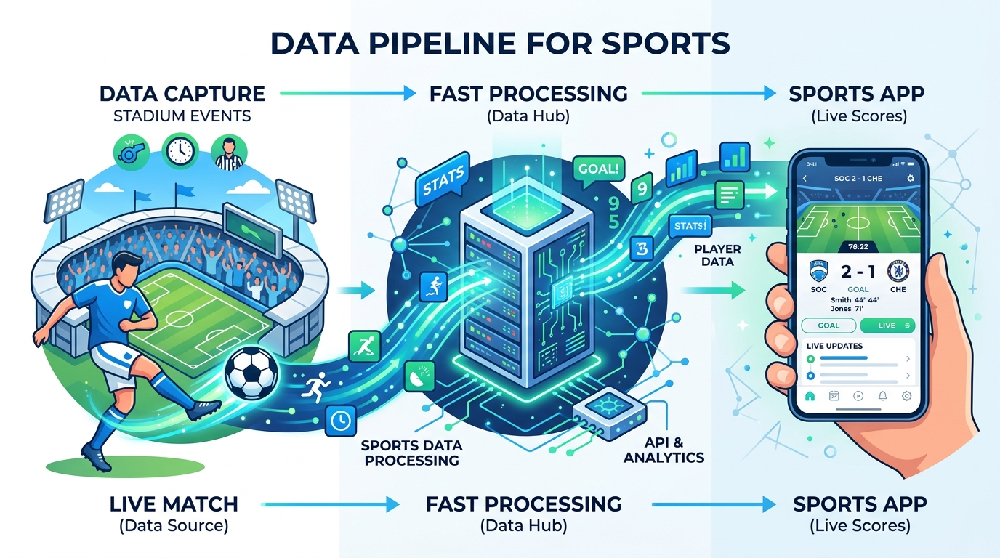



  

# ⚽ Live Sports Data Engine (Football API)

## 📌 The Business Challenge
In the modern sports entertainment industry, fans expect live scores, team statistics, and player data instantly on their phones. But raw data from stadiums is messy and unorganized. Companies need a "digital engine" to process this data at lightning speed and deliver it to web and mobile apps.

## 💡 The Solution
I built a highly efficient **Data API (Application Programming Interface)**. Think of an API like a digital waiter in a restaurant: the mobile app (the customer) asks for the live score, the API goes to the database (the kitchen), retrieves the exact information needed, and serves it back to the phone instantly.

## 🚀 How It Works (In Plain English)
1. **The Database:** Securely stores thousands of records of football matches, teams, and player statistics.
2. **The Engine (FastAPI):** A high-speed processor that listens for requests (e.g., "Give me the score of the Chelsea match").
3. **The Delivery:** The data is formatted cleanly and sent securely over the internet to be displayed on any screen.

## 🛠️ Technology Used
*   **Python (FastAPI):** One of the fastest and most modern frameworks for building web APIs.
*   **Cloud Architecture:** Designed to run on remote servers so it is always online, 24/7.
*   **Data Validation:** Ensures that the data being requested and sent is accurate and secure.

## 📊 Business Value Delivered
*   **Real-Time Performance:** Engineered for high speed, ensuring end-users get live updates without lag.
*   **Scalability:** Built in a way that allows the system to handle millions of requests simultaneously (e.g., during the World Cup final).
*   **Developer Friendly:** The data is structured perfectly so frontend app developers can easily plug it into their mobile apps.

---
*Created by [Iman Moradi Nezhad](https://github.com/ImanMrd) | Showcasing Backend Engineering and Data Delivery.*
